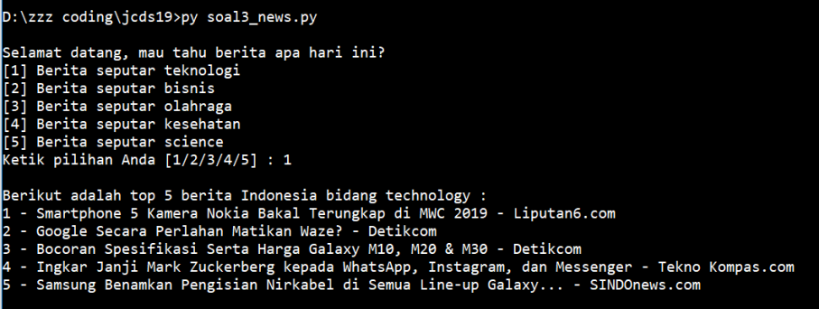
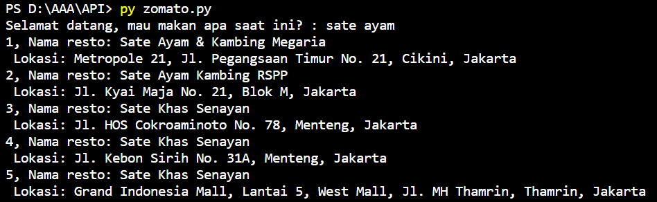

# Request API Exercises


#

### **Soal 1 - 📰 Top 5 News**

Buatlah sebuah __file Python interaktif__ untuk menyajikan top 5 informasi/berita hari ini kepada user seputar _teknologi, bisnis, olahraga, kesehatan_ dan _sains_ di Indonesia. Gunakan __News API__ [(klik di sini)](https://newsapi.org), login & dapatkan __API Key__ untuk menggunakan API tersebut. Untuk memanfaatkan API berita seputar _teknologi, bisnis, olahraga, kesehatan_ dan _sains_ di Indonesia, baca dokumentasi berikut:
1. [News API - Berita Indonesia - Teknologi](https://newsapi.org/s/indonesia-technology-news-api)
2. [News API - Berita Indonesia - Bisnis](https://newsapi.org/s/indonesia-business-news-api)
3. [News API - Berita Indonesia - Olahraga](https://newsapi.org/s/indonesia-sports-news-api)
4. [News API - Berita Indonesia - Kesehatan](https://newsapi.org/s/indonesia-health-news-api)
5. [News API - Berita Indonesia - Sains](https://newsapi.org/s/indonesia-science-news-api)

- __Case Flow__: Saat dieksekusi, program akan menawarkan 5 pilihan berita kepada user, yakni berita seputar _teknologi, bisnis, olahraga, kesehatan_ dan _sains_ di Indonesia. Usai user menentukan pilihan, program akan menyajikan __top 5 judul berita hari__ ini di bidang yang user pilih. _Cukup judul beritanya saja!_

- __Note__: Selesaikan hanya dengan memanfaatkan __requests__ package! News API menyediakan package khusus untuk Python yang dapat Anda install melalui pip ([selengkapnya klik sini](https://newsapi.org/docs/client-libraries/python)):

    ```bash
    $ pip install newsapi-python
    ```
    Namun Anda tidak diperkenankan menggunakan package tersebut. Cukup dengan __requests__ package saja.

- Output yang diharapkan saat file diekseskusi via terminal:
  
  ```bash
    Selamat datang, mau tahu berita apa hari ini?
    [1] Berita seputar teknologi
    [2] Berita seputar bisnis
    [3] Berita seputar olahraga
    [4] Berita seputar kesehatan
    [5] Berita seputar science
    Ketik pilihan Anda [1/2/3/4/5] : 3

    Berikut adalah top 5 berita Indonesia bidang sports :
    1 - Coutinho Memble, Valverde Membela - Bola.net
    2 - Beda Mourinho dan Solskjaer Versi Winger MU - Bola - Liputan6.com
    3 - Lorenzo Anggap Marquez Sama dengan Rossi - Kompas.com - KOMPAS.com
    4 - Anders Antonsen, Juara Narsis yang Idolakan Taufik Hidayat - VIVA.co.id
    5 - Final Tragis, Ratu Bulutangkis Dunia Mendadak Terkapar di Senayan - VIVA - VIVA.co.id
  ```

- Contoh screenshot:

    

_**Catatan:**_ _Lampiran jawaban dalam bentuk file topnews.py yang sudah diupload_

#

### **Soal 2 - 🛵 Jarak Dilan & Milea**

Selepas SMA, Dilan & Milea memutuskan untuk berpisah & fokus belajar _coding_ di [Purwadhika Startup & Coding School](https://www.purwadhika.com/). Dilan mengambil program _Job Connector Web & Mobile_ di Purwadhika BSD, sementara Milea mengikuti program _Job Connector Data Science_ di Purwadhika Bandung.

Sehari-hari Dilan beraktivitas di [Purwadhika BSD](https://www.google.com/maps/place/Purwadhika+Startup+%26+Coding+School+BSD/@-6.302403,106.652248,15z/data=!4m2!3m1!1s0x0:0xa3d17293fd1fcd?sa=X&ved=2ahUKEwi-tJTH_s_nAhUH4jgGHeptAfkQ_BIwCnoECA8QCA) yang terletak di Green Office Park 9, Kelurahan __SAMPORA__, Kecamatan __CISAUK__, Kabupaten __TANGERANG__, Provinsi __BANTEN__. Milea pun sibuk belajar di [Purwadhika Bandung](https://www.google.com/maps/place/Purwadhika+Startup+and+Coding+School+Bandung/@-6.9049166,107.6133146,15z/data=!4m5!3m4!1s0x0:0x5dcb022ab9f2b9c6!8m2!3d-6.9049166!4d107.6133146) yang berlokasi di NextSPACE by UnionSPACE, Kelurahan __CITARUM__, Kecamatan __BANDUNG WETAN__, Kota __BANDUNG__, Provinsi __JAWA BARAT__.


Buatlah __sebuah file python__ (*.py*) yang dapat menghitung jarak (dalam _km_) antara Dilan (Purwadhika BSD) & Milea (Purwadhika Bandung). Untuk menghitungnya, Anda dapat memanfaatkan 3 buah REST API berikut.

- Disediakan API untuk mengakses daftar __Provinsi__ & __kode Provinsi__ di Indonesia. Untuk mengakses data tersebut, lakukan HTTP GET request ke URL endpoint berikut.

    ```bash
    http://raw.githubusercontent.com/LintangWisesa/Ujian_Fundamental_JCDS08/master/data/provinsi.json
    ```

- Disediakan API untuk mengakses daftar kode Provinsi di Indonesia beserta seluruh __Kelurahan__ (_urban_), __Kecamatan__ (_sub district_), __Kota/Kabupaten__ (_city_) & __Kode Pos__ (_postal code_) yang ada dalam Provinsi tersebut. Untuk mengakses data, lakukan HTTP GET request ke URL endpoint berikut.

    ```bash
    http://raw.githubusercontent.com/LintangWisesa/Ujian_Fundamental_JCDS08/master/data/kodepos.json
    ```

- [ZipCodeAPI.com](https://www.zipcodeapi.com/API) memberikan fasilitas untuk melakukan perhitungan jarak, radius & lokasi-lokasi di __Amerika Serikat__ berdasarkan kode posnya. [ZipCodeAPI.com](https://www.zipcodeapi.com/API) memungkinkan user untuk menghitung jarak antara 2 atau lebih lokasi berdasarkan kode posnya. Di soal ini kita __abaikan__ fakta bahwa [ZipCodeAPI.com](https://www.zipcodeapi.com/API) hanya berlaku untuk kode pos di Amerika Serikat, sehingga kita dapat menggunakan kode pos di Indonesia. 

    Lakukan registrasi secara gratis untuk mendapatkan __API key__. Perlu diperhatikan, akun gratis ZipCodeAPI layanannya dibatasi hanya __10 API call/jam__ plus _free trial period_ __50 API call/jam selama 2 minggu__. Untuk menghitung jarak antara 2 kode pos dalam _km_, lakukan HTTP GET request ke URL endpoint berikut.

    ```bash
    http://www.zipcodeapi.com/rest/{APIkeyAnda}/distance.json/{kodepos1}/{kodepos2}/km
    ```

Pastikan Anda melakukan GET request API secara efektif & efisien, supaya tidak melampaui _limit API call_. Output yang diharapkan berupa informasi kode pos lokasi beserta jarak antara Dilan & Milea menurut [ZipCodeAPI.com](https://www.zipcodeapi.com/API).

```bash
Kode Pos lokasi Dilan adalah XXXXX 
Kode Pos lokasi Milea adalah YYYYY
Jarak Dilan & Milea adalah ZZZZZ km
```

_**Catatan:**_ _Lampiran jawaban dalam bentuk file dilanmilea.py yang sudah diupload_

#

### **Soal 3 - 🍽️ Jakarta Food Bangers**

Buatlah sebuah __file Python interaktif__ untuk menampilkan rekomendasi tempat makan beserta lokasinya dengan input makanan yang sesuai user inginkan di Jakarta. Gunakan __Zomato API__ [(klik di sini)](https://developers.zomato.com/), login & dapatkan __API Key__ untuk menggunakan API tersebut.

- __Case Flow__: Saat dieksekusi, program akan menanyakan pilihan makanan kepada user. Usai user menentukan pilihan, program akan menyajikan __Nama resto & Lokasi resto__ sesuai yang user pilih.


- Output yang diharapkan saat file diekseskusi via terminal:
  
  ```bash
    Selamat datang, mau makan apa saat ini? sate ayam

    1, Nama resto: Sate Ayam & Kambing Megaria
    Lokasi: Metropole 21, Jl. Pegangsaan Timur No. 21, Cikini, Jakarta
    2, Nama resto: Sate Ayam Kambing RSPP
    Lokasi: Jl. Kyai Maja No. 21, Blok M, Jakarta
    3, Nama resto: Sate Khas Senayan
    Lokasi: Jl. HOS Cokroaminoto No. 78, Menteng, Jakarta
    4, Nama resto: Tesate
    Lokasi: Jl. Sam Ratulangi No. 39, Menteng, Jakarta
    5, Nama resto: Sate Ayam Cilacap
    Lokasi: Jl. Kramat Kwitang 1D No. 20, Senen, Jakarta
  ```

- Contoh screenshot:

    

_**Catatan:**_ _Lampiran jawaban dalam bentuk file zomato.py yang sudah diupload_

#

